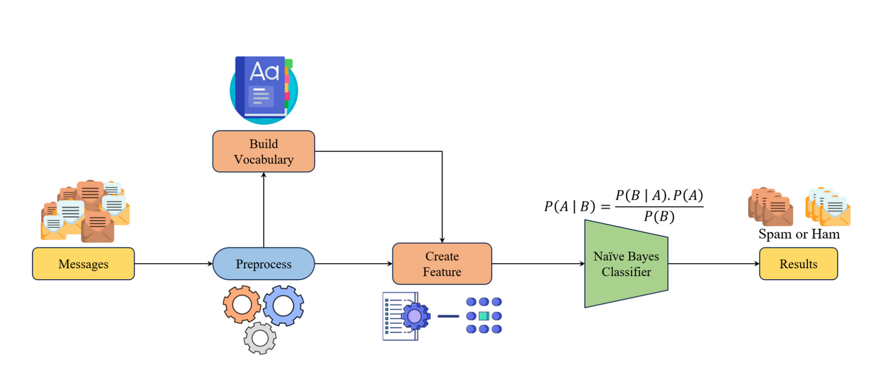

# spam-message-classification
In this project, we will build a Text Classification program that classifies whether a message is spam or not, using the Naive Bayes algorithm. Accordingly, the program's Input/Output includes:
• Input: A text message.
• Output: Whether it is a spam message or not (bool).

## Pipeline
